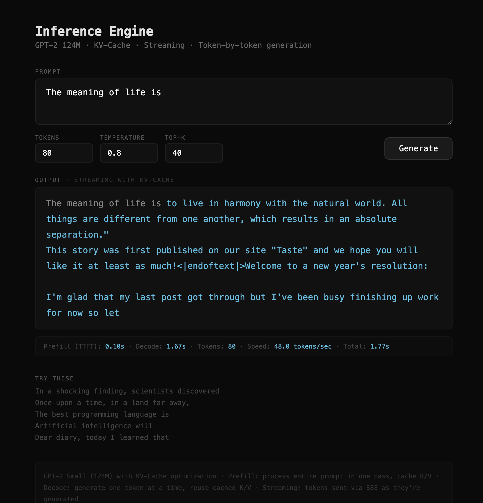

# Inference Engine

[](https://python.org)
[](https://pytorch.org)
[](LICENSE)

> A from-scratch inference engine for GPT-2 implementing KV-cache, PagedAttention, Flash Attention, continuous batching, and streaming generation. Same model, same weights — but 2.6x faster through caching, with a custom Triton kernel for attention. No libraries for inference, every optimization written by hand.

**Part of the [Deep Learning from Scratch](https://github.com/aserputov?tab=repositories) series:**
[Word2Vec](https://github.com/aserputov/word2vec-from-scratch) → [RNN / LSTM](https://github.com/aserputov/rnn-from-scratch) → [Transformer](https://github.com/aserputov/attention-from-scratch) → [GPT-2](https://github.com/aserputov/gpt2-from-scratch) → **Inference Engine**

---

## Interactive Demo

Flask-based streaming interface with real-time performance metrics. Tokens appear one by one via Server-Sent Events, powered by KV-cache and continuous batching under the hood.



```bash
python3 demo.py    # downloads weights on first run, serves at http://localhost:5004
```

---

## Abstract

This project takes the GPT-2 implementation from the [previous project](https://github.com/aserputov/gpt2-from-scratch) and makes it fast. The naive approach recomputes the entire sequence for every new token — O(n²) total work. We implement four optimizations from scratch:

1. **KV-Cache** — store Key/Value matrices from past steps, reducing each decode step from O(n) to O(1) new computation → **2.6x speedup**
2. **PagedAttention** — pre-allocated page pool eliminates `torch.cat` memory copies → **1.16x** over naive caching
3. **Flash Attention** — custom Triton kernel that tiles Q×K^T in GPU SRAM, avoiding the O(T²) memory scores matrix
4. **Continuous Batching** — multiple requests share the model, new requests fill finished slots without waiting
5. **Streaming** — token-by-token output via Server-Sent Events

---

## The Problem: Redundant Computation

Without cache, generating token 100 means running the full model on all 100 tokens — even though tokens 1-99 haven't changed:

```
Step 1:  process [The]                          → predict "meaning"
Step 2:  process [The, meaning]                 → predict "of"       ← recomputes "The"
Step 3:  process [The, meaning, of]             → predict "life"     ← recomputes "The", "meaning"
...
Step 99: process [The, meaning, of, ..., word₉₈] → predict word₉₉   ← recomputes ALL 98 tokens
```

Total attention computations: 1 + 2 + 3 + ... + n = **O(n²)**

---

## Optimization 1: KV-Cache

In attention, we compute Q, K, V for each token. But K and V for past tokens never change (causal mask means they can't see the future). So we cache them:

```
Prefill:  process [The, meaning, of, life, is]  → cache K,V for all 5 tokens → predict "to"
Decode 1: process [to]     + cached K,V          → append to cache → predict "live"
Decode 2: process [live]   + cached K,V          → append to cache → predict "in"
Decode 3: process [in]     + cached K,V          → append to cache → predict "harmony"
```

Each decode step only processes **1 new token** and concatenates its K,V with the cache.

### Two Phases of Generation

| Phase | Input | Work | When |
|-------|-------|------|------|
| **Prefill** | Entire prompt (N tokens) | Process all N at once, build KV-cache | Once, at the start |
| **Decode** | 1 token at a time | Compute Q,K,V for new token only, reuse cached K,V | Repeated for each generated token |

This is why you see two metrics in the demo:
- **TTFT (Time to First Token)** — prefill duration
- **Decode speed** — tokens/sec during generation

### Key Code: Cached Attention

```python
def forward(self, x, kv_cache=None):
    q, k, v = self.c_attn(x).split(C, dim=2)     # compute Q,K,V for new token(s)

    if kv_cache is not None:
        prev_k, prev_v = kv_cache
        k = torch.cat([prev_k, k], dim=2)          # append new K to cached K
        v = torch.cat([prev_v, v], dim=2)          # append new V to cached V

    new_cache = (k, v)                              # save for next step
    scores = (q @ k.T) / sqrt(d)                   # attend to ALL keys (cached + new)
    return output, new_cache
```

---

## Optimization 2: PagedAttention

The naive KV-cache uses `torch.cat` to append new K/V tensors at each step. This **allocates a new tensor and copies all previous data** every single time:

```
Step 1: allocate [1 token],     copy 0          → 0 copies
Step 2: allocate [2 tokens],    copy 1 token    → 1 copy
Step 3: allocate [3 tokens],    copy 2 tokens   → 2 copies
...
Step n: allocate [n tokens],    copy n-1 tokens → n-1 copies

Total copies: 0 + 1 + 2 + ... + (n-1) = O(n²)
```

PagedAttention solves this with a **pre-allocated page pool** — like virtual memory for KV-cache:

```
┌─────────────────────────────────────────────────────────┐
│  Page Pool (pre-allocated at startup)                   │
│  ┌──────┐ ┌──────┐ ┌──────┐ ┌──────┐ ┌──────┐         │
│  │Page 0│ │Page 1│ │Page 2│ │Page 3│ │Page 4│  ...     │
│  │16 slots│16 slots│16 slots│16 slots│16 slots│         │
│  └──────┘ └──────┘ └──────┘ └──────┘ └──────┘         │
└─────────────────────────────────────────────────────────┘

Sequence A page table: [Page 0, Page 2]   ← 32 slots, non-contiguous
Sequence B page table: [Page 1, Page 4]   ← 32 slots, non-contiguous
Free pages: [Page 3, ...]
```

Each new token writes directly to the next slot in the current page — **zero copies, zero allocations**:

```python
class PagedKVCache:
    def __init__(self, n_layers, n_heads, head_dim, page_size=16, max_pages=256):
        self.k_pool = torch.zeros(max_pages, n_heads, page_size, head_dim)  # pre-allocated
        self.v_pool = torch.zeros(max_pages, n_heads, page_size, head_dim)
        self.free_pages = list(range(max_pages))
        self.sequences = {}  # seq_id → page_table + length

    def append(self, seq_id, layer_idx, new_k, new_v):
        slot = position % self.page_size
        if slot == 0:                           # page full → grab a new one
            page_id = self.free_pages.pop(0)
        self.k_pool[page_id, :, slot, :] = new_k   # write directly, no copy
        self.v_pool[page_id, :, slot, :] = new_v
```

---

## Optimization 3: Flash Attention (GPU)

> Requires NVIDIA GPU + Triton. Code in `engine_cuda.py`.

Standard attention computes Q × K^T and stores the full T×T scores matrix in GPU HBM (high-bandwidth memory). For T=1024 with 12 heads, that's **48 MB** just for scores. For T=8192 (like modern LLMs), it's **3 GB**.

Flash Attention never builds the full matrix. Instead, it loads small tiles of Q, K, V into GPU **SRAM** (~20 MB, 10x faster than HBM) and computes attention incrementally:

```
Standard attention (what happens in HBM):
  scores = Q @ K^T     ← full T×T matrix, lives in HBM
  weights = softmax(scores)
  out = weights @ V

Flash Attention (what happens in SRAM):
  for each Q_tile (64 rows of Q):          ← loaded into SRAM once
    for each K_tile, V_tile (64 rows):      ← streamed from HBM
      s = Q_tile @ K_tile^T                 ← 64×64 tile, fits in SRAM
      update running softmax (online trick)
      accumulate into output tile
```

The key insight is **online softmax** — you don't need all scores to compute softmax. You can process tiles incrementally by tracking a running max and running sum:

```python
# Online softmax: process K tiles one at a time
m_new = max(m_old, max(current_tile))        # update running max
alpha = exp(m_old - m_new)                    # rescale factor
p = exp(scores - m_new)                       # softmax numerator for this tile
acc = acc * alpha + p @ V_tile               # rescale old output + add new
l = l * alpha + sum(p)                       # rescale old denominator + add new
# At the end: output = acc / l
```

### Memory Comparison

| Sequence Length | Standard Attention | Flash Attention | Ratio |
|----------------|-------------------|-----------------|-------|
| T = 256 | 3.0 MB | 0.012 MB | 250x less |
| T = 512 | 12.0 MB | 0.012 MB | 1000x less |
| T = 1024 | 48.0 MB | 0.012 MB | 4000x less |

The Flash tile is always 64×64 × 12 heads = 0.012 MB regardless of sequence length.

### Implementation: Triton Kernel

The kernel is written in [Triton](https://github.com/triton-lang/triton) — a language for writing GPU kernels in Python that compiles to optimized PTX (NVIDIA assembly):

```python
@triton.jit
def _flash_attn_fwd(Q, K, V, Out, ...):
    pid_m = tl.program_id(0)   # which tile of queries
    pid_z = tl.program_id(1)   # which batch × head

    # Load Q tile into SRAM — stays here for entire loop
    q = tl.load(q_ptrs)

    # Iterate over K,V tiles (streaming from HBM)
    for start_n in range(0, causal_bound, BLOCK_N):
        kt = tl.load(k_ptrs)          # K tile (transposed)
        s = tl.dot(q, kt)             # Q × K^T in SRAM, never in HBM
        s = tl.where(causal_mask, s, -inf)

        # Online softmax update
        m_new = tl.maximum(m_i, tl.max(s, 1))
        p = tl.exp(s - m_new)
        v = tl.load(v_ptrs)           # V tile

        acc = acc * tl.exp(m_i - m_new) + tl.dot(p, v)
        l_i = l_i * tl.exp(m_i - m_new) + tl.sum(p, 1)
        m_i = m_new

    tl.store(o_ptrs, acc / l_i)        # final normalized output
```

### Model Design

Flash Attention optimizes the **prefill phase** (processing the full prompt). During decode, Q is just 1 token — no T×T matrix to tile. So `GPT2Flash` uses:
- **Prefill**: Flash Attention (Triton kernel, no T×T matrix)
- **Decode**: Standard attention with KV-cache (Q is 1 token, no benefit from tiling)

---

## Optimization 4: Continuous Batching

### The Problem with Static Batching

Traditional batching waits for all requests to finish before accepting new ones:

```
Static batching:
  Request A: [████████████████]  done at step 16
  Request B: [████████]          done at step 8, waits 8 more steps
  Request C: [████████████]      done at step 12, waits 4 more steps
                                 ↑ wasted GPU cycles
```

### Continuous Batching

New requests fill empty slots immediately. No request ever waits for others to finish:

```
Continuous batching:
  Slot 1: [Request A ████████████████][Request D ██████████]
  Slot 2: [Request B ████████][Request E ████████████████████]
  Slot 3: [Request C ████████████][Request F ██████████████]
                                  ↑ no gaps, no waiting
```

### Key Code: Scheduler

```python
class ContinuousBatchingScheduler:
    def __init__(self, model, max_batch_size=8):
        self.waiting = queue.Queue()    # incoming requests
        self.active = []                # currently generating
        # background thread runs _loop()

    def _loop(self):
        while self.running:
            # remove finished requests
            self.active = [r for r in self.active if not r.finished]

            # fill empty slots from waiting queue
            while len(self.active) < self.max_batch_size and not self.waiting.empty():
                self.active.append(self.waiting.get())

            # one decode step for each active request
            self._step(self.active)
```

Each `Request` has its own KV-cache and output queue, so tokens stream independently per client.

---

## Benchmark Results

```
Prompt: "The meaning of life is" | 100 tokens | 3 runs average (Apple M1)

  No cache:   5.32s  |  18.8 tokens/sec
  KV-cache:   2.02s  |  49.4 tokens/sec
  Speedup:    2.63x faster with KV-cache

  torch.cat KV-cache:  2.02s  |  49.4 tokens/sec
  PagedAttention:      1.74s  |  57.4 tokens/sec
  Speedup:             1.16x faster with PagedAttention
```

The KV-cache speedup grows with sequence length — longer generations benefit more from caching. PagedAttention advantage also grows with sequence length since it avoids the O(n²) copy overhead of `torch.cat`.

---

## Additional Optimizations

| Optimization | What it does | Why |
|-------------|-------------|-----|
| **Repetition penalty** | Reduce probability of already-generated tokens | GPT-2 Small tends to loop without it |
| **Streaming (SSE)** | Send each token to client immediately | User sees output as it's generated |
| **Top-K sampling** | Only consider top K most likely tokens | Filters out low-probability noise |
| **Temperature** | Scale logits before softmax | Controls randomness vs determinism |

---

## Why This Matters for Production

Every LLM serving system (vLLM, TGI, TensorRT-LLM) uses these exact optimizations. Understanding them from scratch reveals:

| Concept | What you learn |
|---------|---------------|
| **KV-Cache** | Memory trade-off: O(n × layers × d_model) per request. Why context length is expensive |
| **PagedAttention** | How vLLM manages cache memory like OS virtual memory pages |
| **Continuous Batching** | Why naive batching wastes compute, how to maximize GPU utilization |
| **Prefill vs Decode** | Two fundamentally different phases with different bottlenecks (compute vs memory) |

---

## Quick Start

```bash
git clone https://github.com/aserputov/inference-engine.git
cd inference-engine
pip install -r requirements.txt

python3 engine.py       # CPU benchmarks (no-cache vs KV-cache vs PagedAttention vs batching)
python3 engine_cuda.py  # GPU benchmarks (standard vs flash attention + generation)
python3 demo.py         # launch streaming demo at localhost:5004
```

## Project Structure

```
inference-engine/
├── engine.py          # CPU: GPT2, GPT2Cached, GPT2Paged, continuous batching, benchmarks
├── engine_cuda.py     # GPU: Flash Attention Triton kernel, GPT2Flash, GPU benchmarks
├── demo.py            # Flask streaming demo with SSE + continuous batching
├── assets/
│   └── demo.png       # Demo screenshot
├── requirements.txt
├── LICENSE
└── README.md
```

## Four Model Variants

| File | Variant | Attention | Cache | Device |
|------|---------|-----------|-------|--------|
| `engine.py` | `GPT2` | Standard | None | CPU |
| `engine.py` | `GPT2Cached` | Standard | `torch.cat` KV-cache | CPU |
| `engine.py` | `GPT2Paged` | Standard | PagedAttention (page pool) | CPU |
| `engine_cuda.py` | `GPT2Flash` | Flash (Triton) | KV-cache | GPU |

## References

1. Radford, A., et al. (2019). *Language Models are Unsupervised Multitask Learners.* OpenAI
2. Vaswani, A., et al. (2017). *Attention Is All You Need.* NeurIPS 2017
3. Pope, R., et al. (2022). *Efficiently Scaling Transformer Inference.* MLSys 2023
4. Kwon, W., et al. (2023). *Efficient Memory Management for Large Language Model Serving with PagedAttention.* SOSP 2023

## Series

| Project | Architecture | Status |
|---------|-------------|--------|
| [word2vec-from-scratch](https://github.com/aserputov/word2vec-from-scratch) | Skip-gram embeddings | Done |
| [rnn-from-scratch](https://github.com/aserputov/rnn-from-scratch) | RNN, LSTM, Bahdanau Attention | Done |
| [attention-from-scratch](https://github.com/aserputov/attention-from-scratch) | Transformer encoder-decoder | Done |
| [gpt2-from-scratch](https://github.com/aserputov/gpt2-from-scratch) | GPT-2 decoder-only, real weights | Done |
| **inference-engine** | **KV-cache, PagedAttention, Flash Attention, continuous batching** | **Done** |
